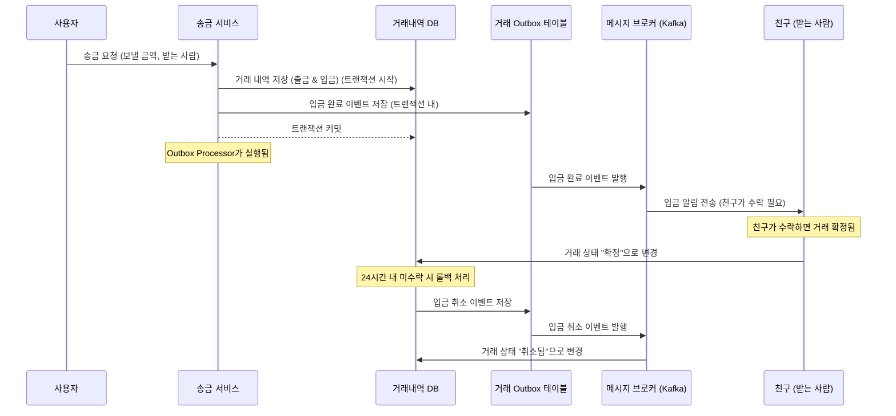

## 시퀀스 다이어그램

```mermaid
sequenceDiagram
    participant User as 사용자
    participant SendMoneyService as 송금 서비스
    participant TransactionDB as 거래내역 DB
    participant Outbox as 거래 Outbox 테이블
    participant Kafka as 메시지 브로커 (Kafka)
    participant Receiver as 친구 (받는 사람)

    User->>SendMoneyService: 송금 요청 (보낼 금액, 받는 사람)
    SendMoneyService->>TransactionDB: 거래 내역 저장 (출금 & 입금) (트랜잭션 시작)
    SendMoneyService->>Outbox: 입금 완료 이벤트 저장 (트랜잭션 내)
    SendMoneyService-->>TransactionDB: 트랜잭션 커밋

    Note over SendMoneyService: Outbox Processor가 실행됨
    Outbox->>Kafka: 입금 완료 이벤트 발행

    Kafka->>Receiver: 입금 알림 전송 (친구가 수락 필요)
    
    Note over Receiver: 친구가 수락하면 거래 확정됨
    Receiver->>TransactionDB: 거래 상태 "확정"으로 변경

    Note over TransactionDB: 24시간 내 미수락 시 롤백 처리
    TransactionDB->>Outbox: 입금 취소 이벤트 저장
    Outbox->>Kafka: 입금 취소 이벤트 발행
    Kafka->>TransactionDB: 거래 상태 "취소됨"으로 변경

```
